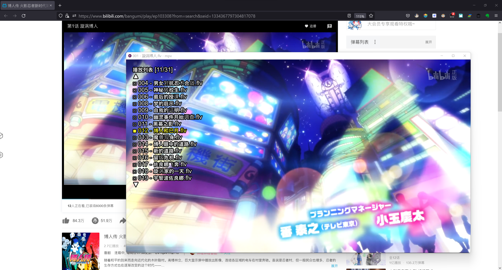
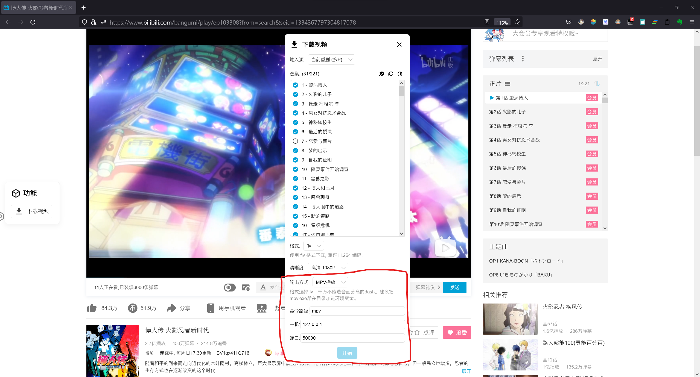

# PlayWithMpv

A server to support playing videos with mpv. Currently this project mainly
supports for  bilibili.com based on Tampermonkey-script [Bilibili-Evolved](https://github.com/the1812/Bilibili-Evolved) (version `2.0.8`)

## Preparation

1.  Install [MPV](https://mpv.io/installation/) or [MPV-lazy](https://github.com/hooke007/MPV_lazy) <del>(If you're newer, strongly recommend MPV-lazy.)</del>
2.  Install Tampermonkey-scrip  [Bilibili-Evolved](https://github.com/the1812/Bilibili-Evolved)
    -   Add “下载视频” 组件 in  [Bilibili-Evolved](https://github.com/the1812/Bilibili-Evolved)
    -   Add [mpv-output-playlist.js插件](https://pan.baidu.com/s/1-Bd_e-irW1Y1H0Ofm0S7BA?pwd=gqvp) to  [Bilibili-Evolved](https://github.com/the1812/Bilibili-Evolved)
3.  Install [Python3](https://www.python.org/downloads/) (>=3.8)

## Installation

Just run `pip install playwithmpv --user`

## Usage

1.  open the terminal, run `playwithmpv` to start the server.
2.  On Bilibili-Evolved:
    -   打开 **下载视频**
    -   格式选 **flv** <del>(如若不可用，先选其他格式，再选回来)</del>
    -   输出方式选 **MPV播放**
    -   若mpv 命令路径已加入环境变量, 默认设置就好，不用更改
3.  Click **开始** and enjoy.

## Autostart

-   Linux: copy the script to `~/.config/autostart`
-   MacOs: [method](https://stackoverflow.com/questions/29338066/run-python-script-at-os-x-startup)
-   Windows: [method](https://stackoverflow.com/questions/4438020/how-to-start-a-python-file-while-windows-starts)

## BTW
If you are interest in watching bangumi with MPV, could see:

-   [A High-Quality Real Time Upscaler for Anime Video](https://github.com/bloc97/Anime4K)
-   [MPV FOR ANIME](https://luukuton.fi/article/mpv-for-anime)
-   [MPV-lazy小站](https://hooke007.github.io/)
-   [How Do I Get The Best SVP4 Settings?](https://www.svp-team.com/forum/viewtopic.php?pid=61292)

> Why use MPV?
> BTW, I think MPV is a so strong and free tool that can be easily for stream vidoes,
> user shaders and movement enhacement etc. 
> The last one using SVP4 as movement enhacement, if you config SVP as the article said and make it work.
> Congratulation, a new world is there.Wooss.
